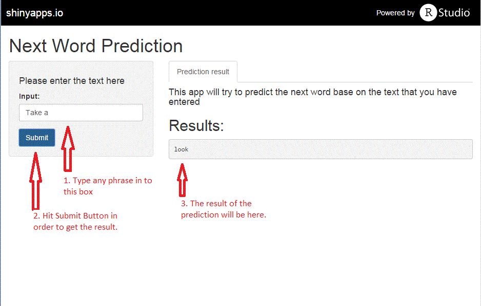

## Next Word Prediction

by

Pattareeya

April 2015

---
## Introduction

We have designed the Shiny app to predict the next word based on the previous sentence or phrase that users have entered. The prediction algorithm was performed based on the data from a corpus called HC Corpora ([www.corpora.heliohost.org](http://www.corpora.heliohost.org))

---
## Algorithm

We have created one-gram, two-gram, three-gram and four-gram tables based on english-language data provided from news, blogs and twitters.

- First, the last 3 words from the input will be matched to the four-gram table and the app will return the most frequent next-word as an output if there are more than one results.

- Next, if there is no match, the last 2 words from the input will be match to the three-gram table and the app will return the most frequent next-word.

---
## Algorithm

- Then, if there is no match from the three-gram table, the last word from the input will be match to the two-gram table and the app will return the most frequent next-word.

- Lastly, if there is not match at all, the app will randomly return one of the most frequent ten words that we got from one-gram table.

---

## How to use the app 

Please visit the [Next Word Prediction app](https://pattareeya.shinyapps.io/project/).

